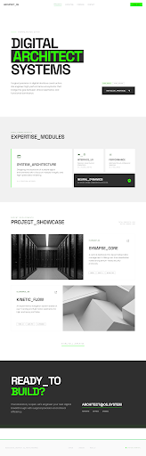

# ARCHITECT_OS // FAJARCODE PORTFOLIO

A high-performance personal portfolio ecosystem engineered for **Fajar**, a Digital Architect and Freelance Web Developer. This platform is designed with a clinical, futuristic HUD (Heads-Up Display) aesthetic, emphasizing surgical precision and functional stability.



## 🛠 Tech Stack

- **Framework**: [Next.js 16](https://nextjs.org/) (App Router)
- **Styling**: [Tailwind CSS 4](https://tailwindcss.com/)
- **Language**: [TypeScript](https://www.typescriptlang.org/)
- **Animation**: Custom CSS Keyframes & sequential React typing engines.
- **Iconography**: Google Material Symbols.

## 🚀 Key Features

- **Hero HUD Redesign**: Dynamic background grid, vertical scanline animations, and real-time status panels (System Load, Uptime, Node Status).
- **Typewriter Identity**: Sequential text animation for identity deployment.
- **Project Showcase**: Sophisticated grid layout with zigzag visual flow and hover-reactive glow effects.
- **ScrollSpy Navigation**: Responsive floating navbar with active-node detection using `IntersectionObserver`.
- **About Me Node**: Biometric data and professional biography deployment.
- **Clinical Aesthetics**: Zinc-based high-contrast palette with neon-green (`primary-container`) accents.

## 📁 System Structure

- `/app`: Root project logic and main identity deployment (`page.tsx`).
- `/components`: Modular UI fragments including the HUD Navbar and Typewriter systems.
- `/public/img`: High-fidelity assets and project snapshots.

## 💻 Initialization

To deploy this ecosystem locally:

```bash
# Clone the repository
git clone https://github.com/devfajarr/porto-me.git

# Install dependencies
npm install

# Initialize development protocol
npm run dev
```

The system will be accessible at `http://localhost:3000`.

## 👤 Author

**Fajar**  
*Freelance Web Developer & Digital Architect*

- **Website**: [siap.polsa.ac.id](https://siap.polsa.ac.id)
- **Email**: [fajarfauzi.dev@gmail.com](mailto:fajarfauzi.dev@gmail.com)
- **WhatsApp**: [+62 823-1122-3344](https://wa.me/6282311223344)

---
*Generated by ARCHITECT_OS // STABLE_RELEASE_2024.04*
